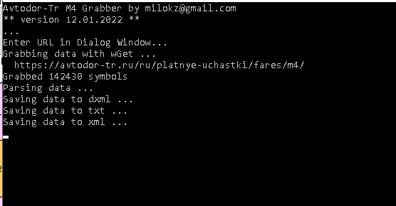

# AvtodorM4Tarrifs

Получение тарифов автодора по М4 и сохранение в стандартизированный Excel XML.   
Приложение может быть использовано как автономно, так и вместе с [KMZRebuilder](https://github.com/dkxce/KMZRebuilder) в планировщике маршрутов.

